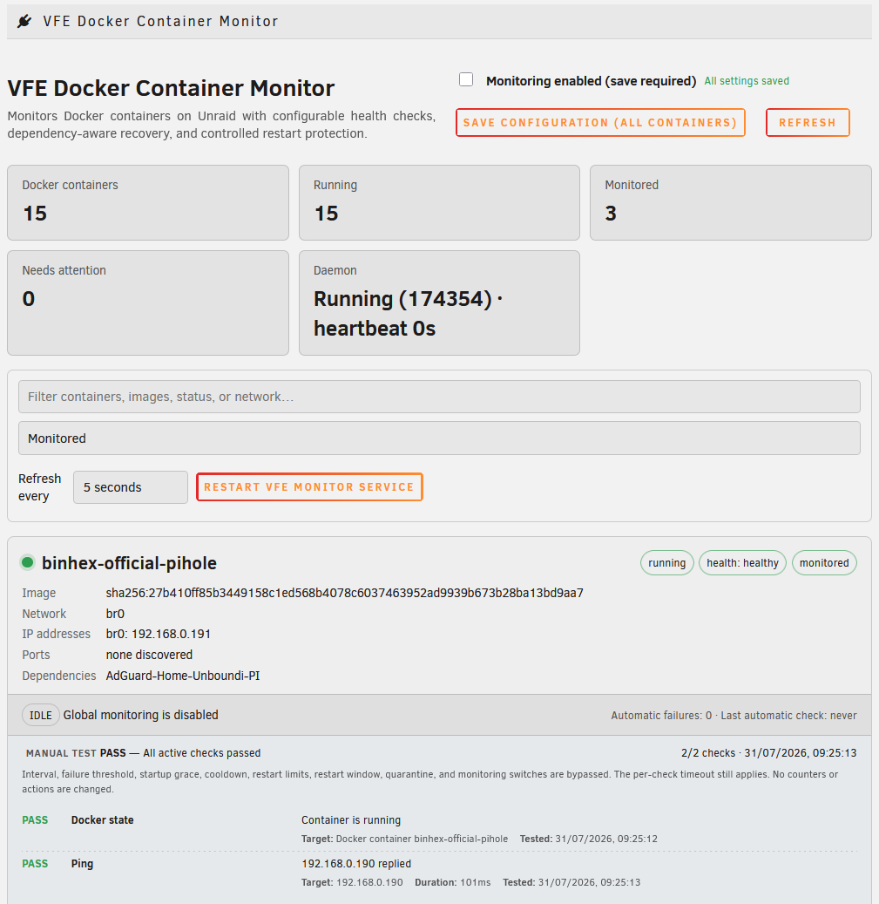
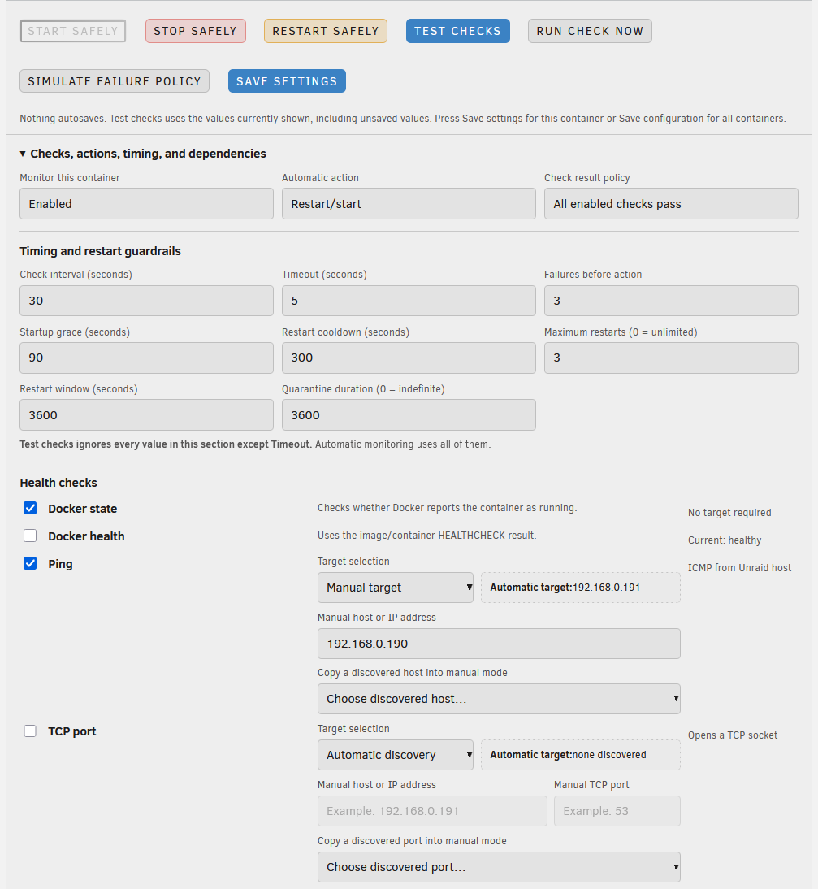
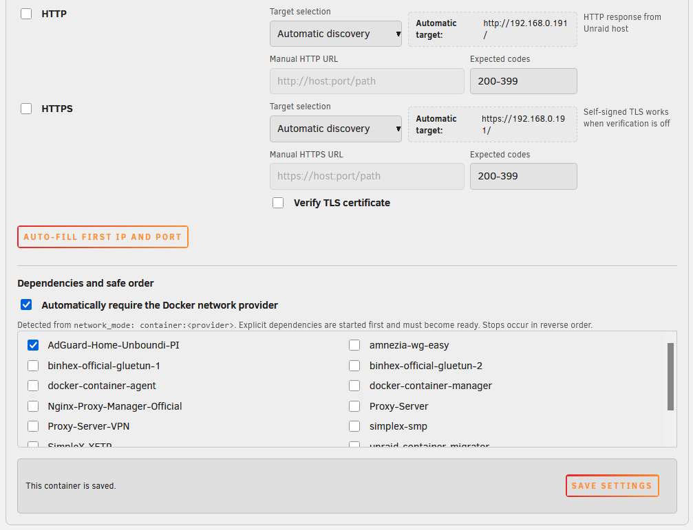

# VFE Docker Container Monitor

Monitors Docker containers on Unraid with configurable health checks, dependency-aware recovery, and controlled restart protection.

<p align="center">
  
  
  
</p>

## Requirements

- Unraid 7.3.0 or newer
- Docker enabled

## Installation

Use the raw GitHub URL in **Plugins → Install Plugin**:

```text
https://raw.githubusercontent.com/flavius-vfe/VFE-docker-container-monitor/main/vfe.docker.container.monitor.plg
```

Or run:

```bash
plugin install https://raw.githubusercontent.com/flavius-vfe/VFE-docker-container-monitor/main/vfe.docker.container.monitor.plg
```

## Configuration

Open **Settings → VFE Docker Container Monitor**. Settings are committed only when you press the per-container **Save settings** button or the global **Save configuration** button.

## Support

GitHub issues are available at:

```text
https://github.com/flavius-vfe/VFE-docker-container-monitor/issues
```
## License

MIT License. See `LICENSE`.
